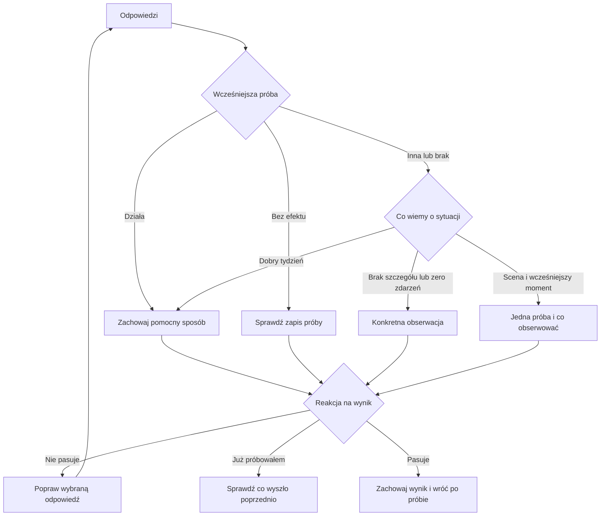

# Diagnostyka 168: pełna redakcja v3.5

Zakres: aktywna diagnostyka na `/`, pytania, 28 konkretnych wyników, utrzymanie działającego sposobu, brak danych, wcześniejsze próby, reakcje na wynik, dalsze kroki, zaproszenie, zgody i zapis. Historyczne komponenty v2 nie są aktywnym wejściem i pozostają bez zmian.

## Głos

Owner: [MICHAŁ VOICE / LANGUAGE CANONICAL](https://app.notion.com/p/3c1d3f5a0f5b810d9a3ff44e50296f6d).
Profil: HiT. Powierzchnie: Page oraz UX/Form. Przeczytano canonical, oba powiązane gate'y, runtime, korekty, VOICE_SOURCE_POLICY i VOICE_BANK.csv. Próbki do rytmu i sposobu prowadzenia myśli: VB-133, VB-139, VB-142, VB-148, VB-153, VB-158, VB-165, źródła IGWHISPER wskazane w banku. Historyczne liczby, medyczne twierdzenia i oferty z próbek nie są przenoszone do testu. Nowszy zakaz sloganowych kontrastów ma pierwszeństwo.

Oddzielna ocena języka po redakcji: usunięto ciągi haseł, powtarzanie diagnozy na kilku kartach, formalne komentarze o działaniu formularza i domyślne przypisywanie przyczyny. Zachowano pytanie o wcześniejszy moment oraz prostą decyzję trenerską w każdym wyniku. To redakcyjny przegląd względem próbek, nie wykonanie pełnego zewnętrznego Voice Runtime i nie dowód wzrostu konwersji.

## Finalny flow i decyzje

| Krok | Zadanie pytania | Co zmienia odpowiedź |
|---|---|---|
| Dlaczego teraz | Odróżnić ciekawość od zmiany sytuacji | Termin próby i zaproszenie |
| Cel | Ustalić, na czym zależy odbiorcy | Kryterium obserwacji; przy braku sceny obszar do sprawdzenia |
| Sytuacja | Wybrać rzeczywisty przykład | Rodzina dalszych pytań i wyniku |
| Poprzednia próba | Uniknąć ponownej rady w ciemno | Pytanie o efekt i sposób wykorzystania wcześniejszych ustaleń |
| Efekt próby, jeśli była | Rozdzielić utrzymanie, brak efektu i trudność wykonania | Działający sposób zostaje; brak efektu kieruje do oceny zapisu; pozostałe warianty do wcześniejszego momentu |
| Co było wcześniej | Rozdzielić możliwe przyczyny | Konkretny eksperyment albo obserwacja |
| Szczegół, tylko gdzie potrzebny | Rozróżnić podobne sceny | Praca: pilne zadanie/dokładanie zadań/brak miejsca; posiłek: brak dostępu/brak przerwy/ograniczanie; ekran: czas dla siebie/utrata czasu/trudność ze snem przed telefonem; zmęczenie: rano/po obowiązkach/przy starcie |
| Liczba sytuacji | Ustalić skalę bez wymyślania wzorca | Zero i brak pamięci dają obserwację; jeden przypadek pozostaje pojedynczym przypadkiem |
| Co pomogło, przy dobrym tygodniu | Znaleźć rzecz do zachowania | Osobne kroki dla czasu, przygotowania, elastyczności i pomocy |
| Co chcesz zachować | Uwzględnić realny kompromis | Dopasowanie próby do bliskich, spotkań, swobody i odpoczynku |
| Co odczułeś później | Ustalić zauważony koszt | Dodatkowy sygnał do oceny; brak kosztu nie tworzy presji |

Liczba pytań: 6–11 zależnie od odpowiedzi. Jedno pytanie na ekran. Działający sposób i próba bez widocznego efektu omijają pytania, które nie zmieniłyby zalecenia. Udany tydzień pomija pytanie o koszt.

Dalszy wybór jest opcjonalny. Samodzielnie: zachowanie wyniku, bez CTA do oferty. Plan lub prowadzenie: strona naboru z zachowaniem adresu i parametrów źródła. Potrzeba diagnozy medycznej: informacja o konsultacji, bez CTA sprzedażowego. Odrzucenie wyniku usuwa przycisk jego akceptacji i pierwotne zadanie; zmiana odpowiedzi dopytuje tylko o brakujące zależności.

## Uproszczenie ekranu

Przed: nagłówek, kilka widocznych kart odpowiedzi, liczby, osobny komentarz, karta działania, reakcja, powielona karta doprecyzowania, zaproszenie.

Po: wniosek z krótkim wyjaśnieniem, jedna karta działania i obserwacji, reakcja, zaproszenie. Pełne odpowiedzi są pod „Skąd ten wniosek?”, a ograniczenia, wcześniejsze próby i dalsze kroki pod „Jak to dopasować i co zrobić potem?”. Doprecyzowanie aktualizuje jedną kartę, bez kopiowania jej niżej. Pełny raport pozostaje dostępny do pobrania.

## Granice

Bez filmu można przejść całość. Wynik nie wymaga kontaktu. Wysłanie wyniku i udostępnienie kategorii do tematów mają osobne zgody. Ruchy przycisków i obsługa ograniczonego ruchu pozostają. Brak syntetycznej oceny, fałszywego odliczania i przypisania do oferty na podstawie rzekomej gotowości.

## Weryfikacja

188 istniejących testów: zielone przed końcowym przeglądem UI. Zmieniono testy odwołujące się do starego brzmienia, zachowując sprawdzanie przyczyn, liczby ścieżek, prywatności i routingu. Dalsze wyniki w opisie PR. Backupy pełnego stanu mają datę, godzinę i UTC w nazwie.
